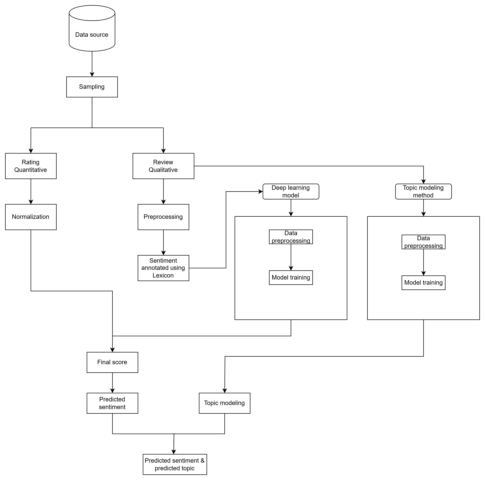

# Sentiment Analysis Project

This project performs **sentiment analysis** and **topic modeling** on text data. It includes modules for data collection, preprocessing, sentiment modeling, topic modeling, and an interactive Streamlit-based dashboard for visualization and analysis.

---

## Features and Functionality

### Data Collection

- **Web Scraping**: Collect text data from the web using a custom-built web scraping module.

### Preprocessing

- **Check and handle nulls and duplicates**: clean and remove any noises consisted in dataset, prepared for model training and analysis.
- **Date Datatype**: The datatype of date has to be datetime datatype, wrong format otherwise.
- **Language Detection**: Review feedback will get only English text for model training and analysis, the rest that are non-english will be labeled base on its rating value.
- **Text Cleaning**: Remove stop words, punctuation, and special characters from text data.
- **Tokenization**: Split text data into individual words and phrases.
- **Lemmatization**: Reduce words to their base form (e.g., "running" becomes "run").
- **Wordembedding**: convert text into vector-based value, for model training and topic modeling..

### Sentiment Analysis

- **BERT Model**: Utilize pre-trained BERT-based models for sentiment analysis.
- **BiLSTM Model**: Implement a BiLSTM-based model for sentiment analysis.

### Topic Modeling

- **Latent Dirichlet Allocation (LDA)**: Apply LDA to identify topics in text data.
- **Latent Semantic Analysis (LSA)**: Use LSA to identify underlying topics and relationships.
- **Non-negative Matrix Factorization (NMF)**: Apply NMF to identify topics in text data.

### Visualization

- **Interactive Dashboard**: Create an interactive dashboard using Streamlit, enabling users to visualize and explore sentiment and topic results.
- **Bubble Charts**: Visualize sentiment and topic distributions using bubble charts.

## Technology Stack

- **Languages**: Python, Shell
- **Frameworks and Libraries**: NLTK, spaCy, scikit-learn, TensorFlow, PyTorch

## Installation and Setup

1. **Prerequisites**: Install Python `3.12.9` and the required libraries mentioned above.
2. **Environment Configuration**: Set up your environment by creating a new virtual environment using `python -m venv myenv` and activating it.
3. **Step-by-Step Installation**: Clone the repository and install required packages using `pip install -r requirements.txt`.
4. **How to Run the Project Locally**: Run the project by executing `streamlit run utils/app.py` in the terminal.

## Project Structure

The project is organized as follows:

- **`dataset/`**: Placeholder or symlink for raw and processed datasets (not tracked in Git).
- **`notebooks/`**: Jupyter notebooks for experimentation and analysis.
  - `main.ipynb`: Primary notebook for exploratory work.
- **`src/`**: Core source code for the project.
  - **`data_annotation/`**: Scripts for data annotation.
    - `annotation.py`: Data annotation logic.
  - **`data_collection/`**: Scripts for collecting data.
    - **`data_scraping/`**: Submodule for web scraping.
      - `data_scraping.py`: Scraping script.
      - `data_scraping.ipynb`: Notebook for scraping experimentation.
  - **`data_preprocessing/`**: Data preprocessing utilities.
    - `__init__.py`: Makes this a Python package.
    - `detect_language.py`: Language detection.
    - `lemmatize.py`: Lemmatization functions.
    - `processing_text.py`: General text processing.
    - `remove_stopword.py`: Stopword removal.
    - `text_cleaning.py`: Text cleaning utilities.
    - `tokenizer.py`: Tokenization functions.
    - `word_embedding.py`: Word embedding utilities.
  - **`sentiment_models/`**: Sentiment analysis models.
    - `__init__.py`: Makes this a Python package.
    - `bert_model.py`: BERT-based sentiment model.
    - `bilstm_model.py`: BiLSTM-based sentiment model.
  - **`topic_modeling/`**: Topic modeling scripts and models.
    - `__init__.py`: Makes this a Python package.
    - **`topic_modeling_model/`**: Directory for trained topic models.
    - `dynamic_topic_naming.py`: Dynamic topic naming logic.
    - `LDA.py`: Latent Dirichlet Allocation implementation.
    - `lsa.py`: Latent Semantic Analysis implementation.
    - `NMF.py`: Non-negative Matrix Factorization implementation.
  - **`utils/`**: Utility scripts and the Streamlit app.
    - `__init__.py`: Makes this a Python package.
    - `app.py`: Streamlit dashboard script.
- **`tests/`**: Unit tests for the project.
  - `__init__.py`: Makes this a Python package.
  - `test_data_preprocessing.py`: Tests for preprocessing scripts.
  - `test_topic_modeling.py`: Tests for topic modeling scripts.
  - `test_utils.py`: Tests for utility scripts.
- **`docs/`**: Documentation files.
  - `api.md`: API documentation (if applicable).
  - `user_guide.md`: User guide for the project.
- **`.gitignore`**: Excludes unnecessary files (e.g., virtual environments, datasets).
- **`README.md`**: Project overview and setup instructions (this file).
- **`requirements.txt`**: List of Python dependencies.
- **`setup.py`**: Optional script for packaging the project (if applicable).
- **`LICENSE`**: License file (e.g., MIT, Apache 2.0).

---

## Features

- **Data Collection**: Scrape and annotate text data for analysis.
- **Preprocessing**: Clean, tokenize, lemmatize, and prepare text data.
- **Sentiment Analysis**: Use BERT and BiLSTM models to classify sentiment.
- **Topic Modeling**: Apply LDA, LSA, and NMF to identify topics in text.
- **Visualization**: Interactive Streamlit dashboard for exploring results, including sentiment distribution, topic distribution, and bubble charts.

---

## Future work roadmap

- **Fine-tuning model**: 
   1. **Datasource**: new dataset
   2. **Data annotation**: 
      - run `data_preprocessing.ipynb` in notebook folder, run all cells in the notebook
      - you will get `annotated_data.csv`
      - check the label and modify the label if necessary for model better performance
   3. **Model training**:
      - fine tune BERT model using the flow in bert.ipynb with the your desired annotated dataset
      - you can try with different hyper-parameter (epoch, batch size or learning rate) and compare its performance
      - after saved your trained model, replace it in the `app.py` in utils folder, to test in streamlit by run `streamlit run utils/app.py`